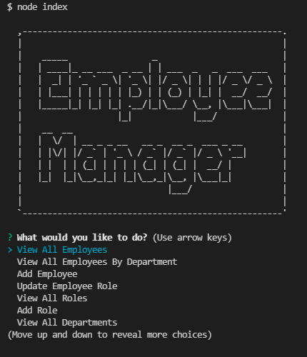

# Employee Tracker
## Description
  * Stores and displays a database of all employees in a company. Allows the user to select from a variety of operations in the command-line.

## Table of Contents
  - [Installation](#installation)
  - [Usage](#usage)
  - [Questions](#questions)

## Installation
  -In the root folder run the following command 

    -npm i

## Usage
  -In the root folder run the following command. You will be presented with various options.
    
    -node index
  
  

## Questions
  * Username: patrbraun
    * Github: https://github.com/patrbraun
  * Email: example@email.com